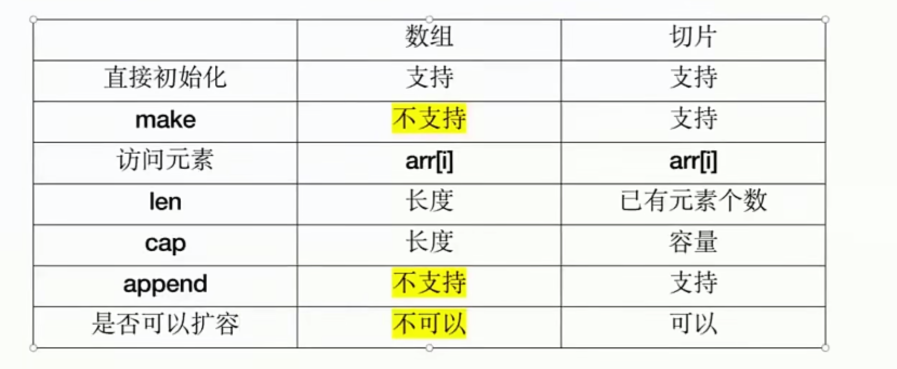

# Go 学习笔记

Go 语音 设计哲学： 简单、显式、组合、并发和面向工程

Go 语言原则：

1. Less is exponentially more -- Rob Pike, Go Designer
2. Do Less, Enable More -- Russ Cox, Go Tech Lead

Go 语言是 一个可以高效编译，支持高并发的，面向垃圾回收的全新语言

* 秒级完成大型应用程序的单节点编译
* 依赖管理清晰
* 不支持继承，程序员无需花费精力定义不同类型之间的关系
* 支持垃圾回收，支持并发执行，支持多线程通讯
* 对多核计算机支持友好

Go 学习资料

1. [Documentation](https://golang.google.cn/doc/)
2. Go优秀项目，优质学习资源 [GolangFamily] (https://github.com/GolangFamily)
3. [Awesome Go](https://github.com/avelino/awesome-go)

## GO ENV

Go 相关命令可以查看 [Command Documentation](https://golang.google.cn/doc/cmd)

通过 go env 命令可以查看 go的环境参数，这点比其他语言好

主要是以下几项:

1. GO111MODULE 控制是否启用 go mod , 默认不用管
2. GOROOT ， go 的安装路径，一般不用配置
3. GOPATH， 设置为自己的 golang 项目放置路径，比如 ： /Users/hz/dev/go/workspace
4. GOPROXY， 推荐使用  https://goproxy.cn
5. GOPRIVATE，指向自己的私有库，或者公司的私有库

## Basic Grammar

Go 相关语法可以查看[Go Programming Language Specification](https://go.dev/ref/spec) [中文版](https://bitbili.net/golang_spec.html)
Go Packages 都在这里可以找到 [Packages](https://pkg.go.dev/) 带 standard library 标记的是标准库

### package

1. 语法形式： package xxxx
2. 字母和下划线的组合
3. 可以和文件夹不同名字
4. 同一个文件夹下的声明一致
5. 引入包的形式:

```go 
import [alias] xxx 
import (
       "fmt", 
       "xx") 
```

6. 引入了包没有使用会报错
7. 匿名引入：签名多加一个 下划线, 如: import _ "strings", 匿名引用 会执行 init() 方法，并且 不会报 未使用错误

需要引入什么包 直接在这里搜索 [Packages](https://pkg.go.dev/)

### Types

#### string

1. 双引号引起来,内部双引号需要 \转义;
2. ``引号引起来，内部需要\转义
3. string 的长度计算： 1> 字节长度(编码无关): len(str) 获取； 2> 字符数量(和编码有关)：用编码库来计算
4. string 拼接 使用 +，参与拼接的 也必须是 string类型
5. strings 包 是 string 相关的 工具方法 如: 查找替换，相等，大小写等等, 比java 的方便多了

更多语法特性 见[string](./examples/first/types/string.go)

#### rune

rune 可以当成 go 中的字符类型, 本质是 int32, 一个rune 四个字节,接近一般语言的 char 或者character的概念

更多语法特性 见[Types](./examples/first/types/types.go)

#### bool, int, uint, float

1. bool: true, false
2. int: int,int8,int16,int32,int64
3. uint: uint,uint8,uint16,uint32,uint64
4. float: float32,float64, complex64, complex128

更多语法特性 见[Types](./examples/first/types/types.go)

#### byte

byte : 字节，本质是uint8。 对应的操作包在 bytes下

更多语法特性 见[byte](./examples/first/types/byte.go)

### 变量声明

局部变量 包变量 块声明

#### var 变量名

语法： var 变量名 类型 = value。 变量命名方式: 驼峰(推荐)

```go
var name type = value
```

#### := 变量声明

```go

func temp() {
name := "张三"
println(name)
}

```

语法: 变量名 := value 。 go使用类型推断来推断类型，数字会被理解为int 或者 float64 (如果是其他类型的数字 需要使用var 来声明)

:= 变量声明只能用于局部变量，既方法内部

更多语法特性 见[var](./examples/first/var_and_const/var.go)

#### 常量声明

```go

const internal = "包内访问"
const External = "包外访问"

```

1. 首字母是否大写控制了可访问性: 大写包外可访问
2. 支持类型推断
3. 无法修改值

访问权限：

1. 首字母大写：包外可访问，首字母小写：只能在这个包里面使用，子包也不能使用

易错点:

* 变量声明了没有使用
* 类型不匹配
* 同作用域下，变量只能声明一次

go 是有类型推断的, 没有隐式的类型推断

更多语法特性 见[const](./examples/first/var_and_const/const.go)

### 方法声明与调用

方法声明有4个部分:

1. 关键字 func
2. 方法名： 首字母是否大写决定了作用域
3. 参数列表 [<name type>]
4. 返回值列表 [<name type>]  返回值是可以有名字的，可以通过命名 让调用方清晰的知道返回的是什么

go 特色：

1. go支持 多返回值
2. 多个参数和多返回值 具有相同类型，可以写在一起只写一次类型

更多语法特性 见 [funcs](./examples/first/func_dec/funcs.go)

### 数组和切片

数组和别的语言差不多， 语法： [cap]type

1. 初始化要指定长度
2. 直接初始化 a1 :=[2]int{1,2,3}
3. arr[i] 的形式访问元素
4. len 和 cap 操作用于获取数组的长度

更多语法特性 见 [array](examples/first/array_and_slice/array.go)

切片， 语法：[]type

1. 直接初始化 s1 := []int{1,2,3}
2. make 初始化 ： make([]type,length,capacity)
3. arr[i] 的形式访问元素
4. append 追加元素
5. len 获取元素数量
6. cap 获取切片容量
7. 推荐写法 s1 := make([]type,0,capacity)

子切片: 数组和切片 都可以 通过[start:end]的形式来获取子切片

1. arr[start:end] start 到 end 之间的元素
2. arr[:end] 0 到 end之间的元素
3. arr[start:] start 到 len(arr) 之间的元素

如何理解切片： 跟Java中的ArrayList 有何区别：

1. 切片操作是有限的，不支持随机增删（没有add, delete方法 需要自己实现）
2. 只有append操作
3. 切片支持子切片操作 (和原本切片共享底层数组)

数组 共享底层？ 如果结构没有变化 是共享的，结构变化了就不共享

更多语法特性 见 [slice](examples/first/array_and_slice/slice.go)



### for

和别的语言差不多 有 3中形式

1. for {} 和 while 类似
2. fori 一般下标循环
3. for range 最为特殊的range遍历
4. break 和 continue 和别的语音一样

### if else

带局部变量声明的 if-else， 变量只能在 if 和 else 代码块中使用，脱离了 if-else 块则不能使用

[ifelse](./examples/first/switch/ifelse.go)

### switch

switch 和别的语音差不多 后面可以跟基础类型 和字符串或者满足特定条件的结构体， 最大的差别 是不用加 break了

[switch](./examples/first/switch/switch.go)

## 常用包

[fmt](./examples/first/fmt/fmt.go)

